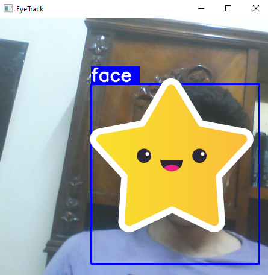

# Face Recognition 
this app make real time face recognition 
this app is inspired from https://github.com/nicknochnack/FaceDetection/blob/main/FaceDetection.ipynb

## what is in this app 
this app is created from scratch 
we scraped the images with python and we labeled them with labelme library 
we augemented the data with albumentations library and we modeled the data and we will 
explain all of this in detail 

## how to run the app 
- first clone the repo 
open your terminal 
```bash 
git clone repo
cd repo 
``` 
- build the structre of the project 
```bash 
cd scripts 
python create_dirs.py
``` 
- scrab the images from the web 
``` bash 
cd scripts 
python get_faces_images.py
python get_impty_images.py 
``` 
- you have to resize the scrabed images and delete the bad ones 
```bash 
cd scripts 
python resize.py 
``` 
- open the notebook and run the labelme cell to triger the api 
and you have to labels the images you select the resized_data/images dir 
and at the top left corner from the drop list select change output dir 
and select resized_data/labels and from the drop list click save automaticly 
after that from the next drop list select draw rectangle and start label your images 

- now you need to split the data 
```bash 
cd scripts 
python split_data.py 
```

- open the notebook again and run the cells to augment the data and train the model 

some of the outputs depend on each other so if you change some things in the scripts like the shape of images you have to make sure that you changed to update all related things 

- you can run your webcam and get real time detection 

